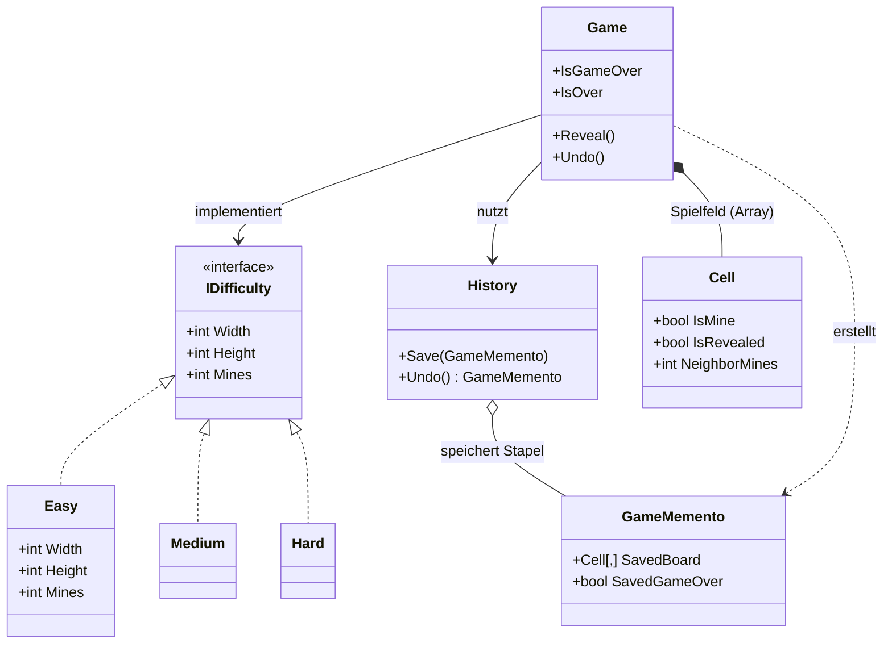

# Minesweeper-in-Cs

Ein Minesweeper Spiel in C-sharp aufgrund eines Schulprojektes

## 1. Rahmenbedingungen für die Umsetzung der funktionalen Anforderungen

Für die Umsetzung der funktionalen Anforderungen gelten folgende softwaretechnische Rahmenbedingungen:

- Erstellen Sie ein Klassendiagramm als technischen Entwurf Ihrer Umsetzung.
- Erstellen Sie ein Sequenzdiagramm für den Ablauf eines Spielzugs (beachten Sie insbesondere die Alternativen).
- Für die Umsetzung der Schwierigkeitsgrade verwenden Sie das Strategy-Pattern. Jeder Schwierigkeitsgrad mit seinen Eigenschaften stellt eine eigene Strategie dar. Es soll selbstverständlich auch möglich sein, beliebige weitere Strategien hinzuzufügen.
- Für die Undo-Funktion, d.h. damit die Spielzüge der Reihe nach rückgängig gemacht werden können, implementieren Sie das Memento-Pattern. Der Spieler soll auch einen Zug, welcher zu GameOver führt, rückgängig machen und anschliessend einen anderen Spielzug wählen können.
- Erstellen Sie Unittests für die komplette Logik. Erstellen Sie vorgängig ein Testkonzept, in welchem Sie die Testfälle aus den Anforderungen ableiten und als Basis für die Umsetzung notieren
- Dokumentieren Sie Ihr Programm in XMLDoc
- Verwenden Sie für weitere Dokumentation das README.MD in Ihrem GitHub-Repository.

Erstellen Sie Unittests, wie Sie das im M320 gelernt haben. Wenden Sie XMLDoc ebenfalls wie gelernt an.

Für die Durchführung sind 2er-Gruppen vorgesehen.

## 2. Spielablauf und Anforderungen

### Der Spielablauf ist folgendermassen:

1) Der Spieler wählt ein Feld, das er aufdecken möchte.
2) Trifft der Spieler eine Bombe, hat er verloren und das Spiel ist vorbei.
3) Ist auf dem Feld keine Bombe versteckt, so zeigt das Feld die Anzahl der Bomben in den 8 umliegenden Feldern an.
4) Das Spiel ist gewonnen, wenn der Spieler alle Felder aufgedeckt hat, die keine Bombe enthalten.

Für die Umsetzung im Rahmen dieser Projektarbeit erstellen Sie das GUI in vereinfachter Form. Konkret zeichnen Sie das Spielfeld auf die Konsole (siehe nachfolgendes Bild). Der Spieler kann nun bei «gewünschtes Feld» die Koordinate (z.B. C4) eingeben. Befindet sich keine Mine im Feld, wird die Anzahl der umliegenden Minen angezeigt. Befindet sich eine Mine im Feld, ist das Spiel verloren.

Entsprechend wird entweder das Spielfeld mit dem aufgedeckten Feld neu ausgegeben oder das Spielende angezeigt.

```
    | 1 | 2 | 3 | 4 | 5 | 6 |
-------------------------------
A   |   |   |   |   |   |   |
-------------------------------
B   |   |   |   |   |   |   |
-------------------------------
C   |   |   |   |   |   |   |
-------------------------------
D   |   |   |   |   |   |   |
-------------------------------
E   |   |   |   |   |   |   |
-------------------------------
F   |   |   |   |   |   |   |
-------------------------------

gewünschtes Feld:
```

### Weitere funktionale Anforderungen:

- Der Spieler soll vorgängig den Schwierigkeitsgrad wählen können. Es sollen zumindest folgende drei Schwierigkeitsgrade zur Verfügung stehen: Einfach, Mittel, Schwer. Diese unterscheiden sich in der Grösse des Spielfeldes sowie in der Anzahl der Minen.
  - Einfach: Feld 8x8 mit 10 Minen
  - Mittel: Feld 16x16 mit 40 Minen
  - Schwer: Feld 30x16 mit 99 Minen
- Die Spielzüge sollen rückgängig gemacht werden können
- Die Stoppuhr, welche die Spielzeit für ein Spiel ausweist, ist optional
- In der bekannten Version des Spiels kann man nicht nur blind Felder aufdecken, sondern auch solche markieren, wo sicher eine Mine liegt (In der oben genannten Onlineversion mit Rechtsklick). Diese Anforderung ist ebenfalls optional.

## 3. Mermaid- und Sequenzdiagramm


